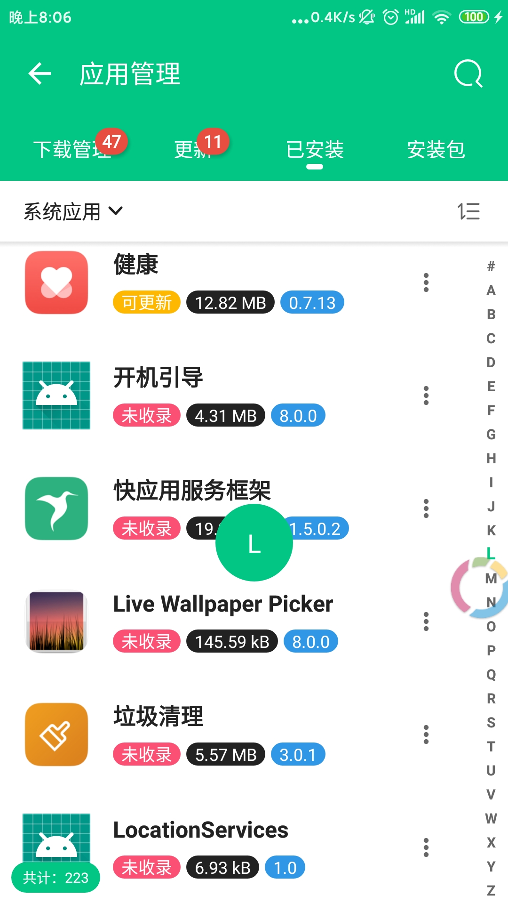

# 应用管理
#### 安卓应用管理和安装包管理App

## 
## 截图预览

    
    
    

## 感谢以下开源库

- [Fragment框架Fragmentation](https://github.com/Z-P-J/Fragmentation)
- [图片加载框架Glide](https://github.com/bumptech/glide)
- [响应式编程框架RxJava](https://github.com/ReactiveX/RxJava)
- [RxJava for Android：RxAndroid](https://github.com/ReactiveX/RxAndroid)
- [数据库框架DBFlow](https://github.com/agrosner/DBFlow)
- [换肤框架、夜间模式chameleon](https://github.com/zhaoxuyang/chameleon)
- [ViewPager指示器框架MagicIndicator](https://github.com/hackware1993/MagicIndicator)
- [毛玻璃效果Blurred](https://github.com/goweii/Blurred)
- [自定义SeekBar库IndicatorSeekBar](https://github.com/warkiz/IndicatorSeekBar)
- [汉字转拼音TinyPinyin](https://github.com/promeG/TinyPinyin)
- [等级评分控件CBRatingBar](https://github.com/CB-ysx/CBRatingBar)
- [BadgeView](https://github.com/qstumn/BadgeView)

## 开发者的开源库

- [Fragment框架ZFragmentation，基于Fragmentation](https://github.com/Z-P-J/ZFragmentation)
- [基于ZFragmentation的弹窗框架ZFragmentation-Dialog](https://github.com/Z-P-J/ZFragmentation-Dialog)
- [网络请求库ZHttp](https://github.com/Z-P-J/ZHttp)
- [文件下载框架ZDownloader](https://github.com/Z-P-J/ZDownloader)
- [RecyclerView框架ZRecyclerView](https://github.com/Z-P-J/ZRecyclerView)
- [事件订阅和分发库RxBus](https://github.com/Z-P-J/RxBus)
- [Rxjava生命周期管理RxLife，基于RxLifeHelper](https://github.com/Z-P-J/RxLife)
- [安卓换肤框架SkinSwitcher，基于chameleon](https://github.com/Z-P-J/SkinSwitcher)
- [状态切换StateManager](https://github.com/Z-P-J/StateManager)
- [自定义ProgressBar](https://github.com/Z-P-J/ZProgressBar)
- [自定义ToolBar:ZToolBar](https://github.com/Z-P-J/ZToolBar)
- [自定义Switch:ZSwitcher](https://github.com/Z-P-J/ZSwitcher)
- [自定义CheckBox:ZCheckBox](https://github.com/Z-P-J/ZCheckBox)
- [吐司ZToast](https://github.com/Z-P-J/ZToast)
- [工具类集合](https://github.com/Z-P-J/ZUtils)